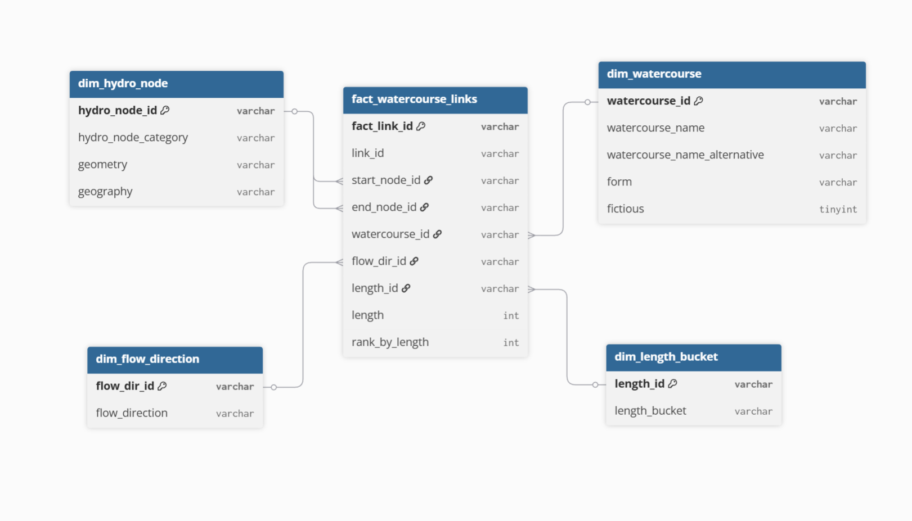
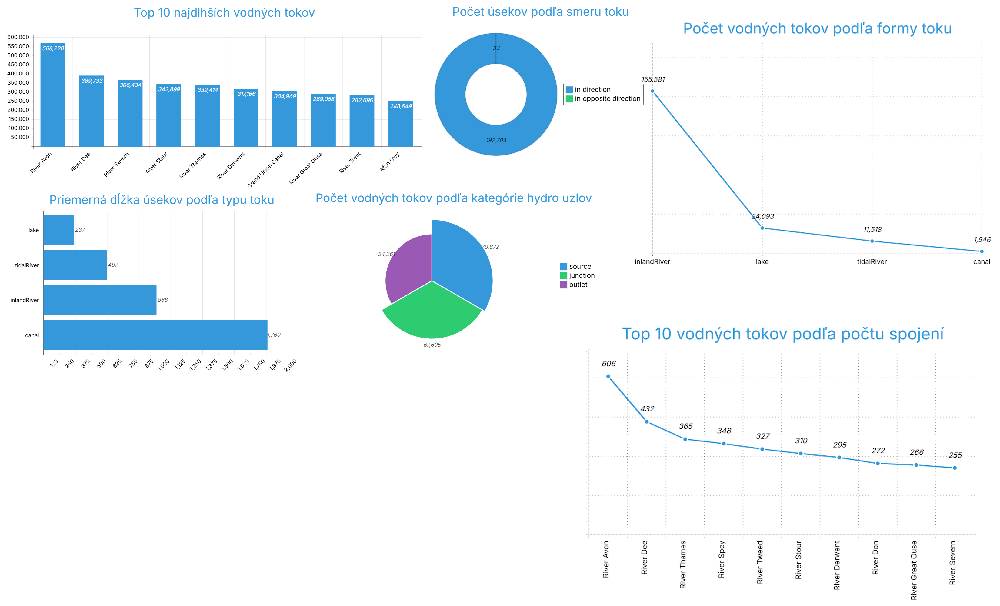

## **1\. Úvod a popis zdrojových dát**

V tomto projekte analyzujem dáta o **riečnej sieti Spojeného kráľovstva**, konkrétne údaje o **hydrologických uzloch** a **vodných tokoch**, ktoré tieto uzly prepájajú. Cieľom analýzy je lepšie porozumieť:

- štruktúre a prepojeniu riečnych systémov,
- vzťahom medzi hydrologickými uzlami,
- charakteristikám vodných tokov (napr. dĺžka, smer toku),
- priestorovým vzorom v riečnej sieti.

Zdrojové dáta pochádzajú z datasetu **"Watercourses, Water Bodies, Rivers - Great Britain: Open Rivers"** dostupného na **Snowflake Marketplace** [**tu**](https://app.snowflake.com/marketplace/listing/GZ1MOZBX006/ordnance-survey-watercourses-water-bodies-rivers-great-britain-open-rivers?categorySecondary=%5B%2228%22%5D).

Dataset obsahuje dve hlavné logické entity:

- **hydrologické uzly (hydro nodes)** - predstavujú zdroje, sútoky a koncové body vodných tokov,
- **vodné toky (watercourse links)** - predstavujú prepojenia medzi uzlami vrátane atribútov, ako je dĺžka alebo smer toku.

Účelom ELT procesu je tieto zdrojové dáta extrahovať, načítať a transformovať do **Star Schemy**, ktorý umožní efektívnu viacdimenzionálnu analýzu a tvorbu vizualizácií.

**1.1 Dátová architektúra**


---

## **2\. Dimenzionálny model**

V rámci projektu som navrhol **schému hviezdy** podľa Kimballovej metodológie pre dataset riečnej siete Spojeného kráľovstva.

Moja faktová tabuľka obsahuje merateľné údaje o jednotlivých úsekoch vodných tokov.

Dimenzionálne tabuľky poskytujú kontext a popisné informácie o faktoch, ktoré umožňujú detailnú viacdimenzionálnu analýzu.

---

**2.1 Faktová tabuľka**

Názov: fact_watercourse_links

Do faktovej tabuľky som zahrnul údaje o úsekoch tokov, ako sú dĺžka, smer toku a prepojenie na hydrologické uzly.

Hlavné stĺpce faktovej tabuľky:

| Stĺpec | Popis |
| --- | --- |
| fact_link_id | Primárny kľúč faktovej tabuľky (surrogate key) |
| link_id | Pôvodné ID úseku z WATERCOURSE_LINK_RAW |
| start_node_id | FK na dimenziu dim_hydro_node - začiatočný uzol |
| end_node_id | FK na dimenziu dim_hydro_node - koncový uzol |
| dim_watercourse_id | FK na dimenziu dim_watercourse |
| dim_flow_dir_id | FK na dimenziu dim_flow_direction |
| dim_length_id | FK na dimenziu dim_length_bucket |
| length | Dĺžka úseku (merateľná metrika) |
| rank_by_length | Window function - poradie úsekov podľa dĺžky pre každý smer toku |

Do faktovej tabuľky som použil window function RANK(), aby som mohol zoradiť úseky podľa dĺžky pre každý smer toku.

**2.2 Dimenzionálne tabuľky**

**dim_hydro_node**

Obsahuje informácie o hydrologických uzloch - zdrojoch, sútoku a koncových bodoch vodných tokov.

**dim_watercourse**

Zahŕňa názvy vodných tokov, alternatívne názvy, typ úseku a prípadný flag fictious.

**dim_flow_direction**

Uchováva informácie o smere toku.

**dim_length_bucket (voliteľná)**

Kategorizuje úseky podľa dĺžky (napr. krátky, stredný, dlhý).

Všetky tabuľky typu 0,statické.


---

## **3\. ELT proces v Snowflake**

ELT proces pozostáva z troch hlavných fáz: extrahovanie (Extract), načítanie (Load) a transformácia (Transform). Tento proces som implementoval v Snowflake s cieľom pripraviť zdrojové dáta zo staging vrstvy do viacdimenzionálneho modelu typu hviezda vhodného na analýzu a vizualizáciu riečnej siete Spojeného kráľovstva.

---

**3.1 Extract (Extrahovanie dát)**

Dáta zo zdrojového datasetu "Watercourses, Water Bodies, Rivers - Great Britain: Open Rivers" dostupného na Snowflake Marketplace som najprv sprístupnil prostredníctvom existujúcich view z marketplace. Pre každý typ dát (hydrologické uzly a vodné toky) som vytvoril staging tabuľky, ktoré slúžia ako dočasná pracovná vrstva pre čistenie a transformáciu.


**Príklad kódu:**

\-- Staging tabuľky pre hydrologické uzly a vodné toky
```sql
CREATE OR REPLACE TABLE HYDRO_NODE_RAW AS
SELECT \*
FROM HIPPO_UK_WATERS_DB.PRS_OPENRIVERS_SCH.PRS_HYDRO_NODE_VW;
CREATE OR REPLACE TABLE WATERCOURSE_LINK_RAW AS
SELECT \*
FROM HIPPO_UK_WATERS_DB.PRS_OPENRIVERS_SCH.PRS_WATERCOURSE_LINK_VW;
```
Tieto staging tabuľky obsahujú všetky pôvodné atribúty zo zdrojového datasetu vrátane identifikátorov, kategórií, geometrie a geografickej polohy pre hydrologické uzly, a informácie o vodných tokoch vrátane názvov, alternatívnych názvov, typu toku, smeru toku a dĺžky.

---

**3.2 Load (Načítanie dát)**

Po extrahovaní dát som ich načítal do Snowflake tabuľky UK_WATERS (nová schéma), kde som pripravoval finálny model. Pretože zdrojové údaje už boli vo forme view, nebolo potrebné vytvárať externé stage ani definovať formáty súborov.

Príklad kódu pre vytvorenie novej schémy a načítanie do staging vrstvy:
```sql
\-- Vytvorenie schémy pre finálne tabuľky
CREATE OR REPLACE SCHEMA UK_WATERS;
\-- Skopírovanie dát zo zdrojových view
CREATE OR REPLACE TABLE UK_WATERS.HYDRO_NODE_RAW AS

SELECT \*
FROM HIPPO_UK_WATERS_DB.PRS_OPENRIVERS_SCH.PRS_HYDRO_NODE_VW;
CREATE OR REPLACE TABLE UK_WATERS.WATERCOURSE_LINK_RAW AS
SELECT \*
FROM HIPPO_UK_WATERS_DB.PRS_OPENRIVERS_SCH.PRS_WATERCOURSE_LINK_VW;
```
**3.3 Transformácia dát**

V tejto fáze som dáta zo staging tabuliek vyčistil, transformoval a obohatil. Hlavným cieľom bolo pripraviť dimenzie a faktovú tabuľku, ktoré umožnia jednoduchú a efektívnu analýzu riečnej siete.

Dimenzie som navrhol tak, aby poskytovali kontext pre faktovú tabuľku:

dim_hydro_node obsahuje údaje o hydrologických uzloch vrátane typu uzla (zdroj, sútok, koncový bod) a priestorovej polohy (geometria a geografia). Táto dimenzia je typu SCD Typ 0, pretože základné charakteristiky uzlov sa nemenia.

dim_watercourse obsahuje informácie o vodných tokoch vrátane názvu toku, alternatívneho názvu, typu toku, smeru toku a dĺžky. Táto dimenzia je takisto typu SCD Typ 0, pretože tieto atribúty sa nemenia v čase.

Príklad kódu pre vytvorenie dimenzií:
```sql
\-- Dimenzia hydrologických uzlov

CREATE OR REPLACE TABLE UK_WATERS.dim_hydro_node AS
SELECT DISTINCT
ID AS dim_hydro_node_id,
HYDRO_NODE_CATEGORY AS node_category,
GEOMETRY,
GEOGRAPHY
FROM UK_WATERS.HYDRO_NODE_RAW;

\-- Dimenzia vodných tokov
CREATE OR REPLACE TABLE UK_WATERS.dim_watercourse AS
SELECT DISTINCT
ID AS dim_watercourse_id,
WATERCOURSE_NAME,
WATERCOURSE_NAME_ALTERNATIVE,
FORM AS watercourse_type,
FLOW_DIRECTION,
LENGTH
FROM UK_WATERS.WATERCOURSE_LINK_RAW;
```
Faktovú tabuľku som vytvoril tak, aby obsahovala prepojenia medzi vodnými tokmi a ich začiatkom a koncom v hydrologických uzloch. Zároveň som do tabuľky zahrnul hlavné metriky toku, ako je jeho dĺžka a smer. Pre vyhodnotenie poradia som použil window funkciu RANK(), ktorá zoradila vodné toky podľa dĺžky v rámci jednotlivých smerov toku.

Príklad kódu pre faktovú tabuľku:
```sql
CREATE OR REPLACE TABLE UK_WATERS.fact_watercourse_links AS
SELECT
ID AS fact_link_id,
LENGTH,
START_NODE,
END_NODE,
d.dim_watercourse_id,
FLOW_DIRECTION,
RANK() OVER (PARTITION BY FLOW_DIRECTION ORDER BY LENGTH DESC) AS rank_by_length
FROM UK_WATERS.WATERCOURSE_LINK_RAW w
JOIN UK_WATERS.dim_watercourse d
ON w.ID = d.dim_watercourse_id;
```
---

## **4 Vizualizácia dát**



---

**Graf 1: Top 10 najdlhších vodných tokov**  
Ukazuje 10 vodných tokov s najväčšou celkovou dĺžkou (sčítané cez všetky úseky). Pomáha identifikovať najvýznamnejšie toky.
```sql
SELECT
w.watercourse_name,
SUM(f.length) AS total_length
FROM UK_WATERS.fact_watercourse_links f
JOIN UK_WATERS.dim_watercourse w
ON f.dim_watercourse_id = w.watercourse_id
WHERE w.watercourse_name IS NOT NULL
GROUP BY w.watercourse_name
ORDER BY total_length DESC
LIMIT 10;
```
---

**Graf 2: Počet úsekov podľa smeru toku**  
Ukazuje počet vodných úsekov v smere „in direction" vs. „opposite direction" a umožňuje analyzovať dominantný smer prúdenia v sieti.
```sql
SELECT
f.flow_direction,
COUNT(\*) AS total_links
FROM UK_WATERS.fact_watercourse_links f
GROUP BY f.flow_direction
ORDER BY total_links DESC;
```
---

**Graf 3: Priemerná dĺžka úsekov podľa typu toku**  
Ukazuje, ako sa priemerná dĺžka jednotlivých úsekov líši podľa typu toku (form), čo pomáha analyzovať charakteristiky toku.
```sql
SELECT
w.form,
AVG(f.length) AS avg_length
FROM UK_WATERS.fact_watercourse_links f
JOIN UK_WATERS.dim_watercourse w
ON f.dim_watercourse_id = w.watercourse_id
GROUP BY w.form
ORDER BY avg_length DESC;
```
---

**Graf 4: Počet vodných tokov podľa kategórie hydro uzlov**  
Ukazuje, koľko vodných tokov začína v jednotlivých typoch hydrologických uzlov (napr. zdroj, sútok, koncový bod), a poskytuje prehľad o štruktúre riečnej siete.
```sql
SELECT
n.hydro_node_category,
COUNT(\*) AS total_links
FROM UK_WATERS.fact_watercourse_links f
JOIN UK_WATERS.dim_hydro_node n
ON f.start_node_id = n.hydro_node_id
GROUP BY n.hydro_node_category
ORDER BY total_links DESC;
```
---

**Graf 5: Počet vodných tokov podľa formy toku**  
Analyzuje typy vodných tokov podľa ich formy (napr. rieka, potok) a poskytuje prehľad o distribúcii rôznych typov tokov v sieti.
```sql
SELECT
w.form,
COUNT(\*) AS total_links
FROM UK_WATERS.fact_watercourse_links f
JOIN UK_WATERS.dim_watercourse w
ON f.dim_watercourse_id = w.watercourse_id
GROUP BY w.form
ORDER BY total_links DESC;
```
---

**Graf 6: Top 10 vodných tokov podľa počtu spojení**  
Zobrazuje 10 vodných tokov, ktoré majú najviac prepojení medzi hydrologickými uzlami, a pomáha identifikovať hlavné vodné toky v sieti.
```sql
SELECT
w.watercourse_name AS watercourse,
COUNT(\*) AS total_links
FROM UK_WATERS.fact_watercourse_links f
JOIN UK_WATERS.dim_watercourse w
ON f.dim_watercourse_id = w.watercourse_id
GROUP BY w.watercourse_name
ORDER BY total_links DESC
LIMIT 10;
```
**Autor:** Volodymyr Ivanov
